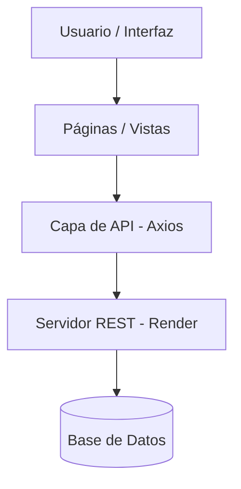

# Arquitectura y Gestión de Datos

Esta sección describe cómo está organizado el código del frontend y cómo fluye la información desde el servidor hasta la interfaz del usuario.

#### 1. Organización del Proyecto

El código sigue una estructura modular basada en responsabilidades para facilitar el mantenimiento:

| Carpeta / Archivo      | Función                                                                           |
| ---------------------- | --------------------------------------------------------------------------------- |
| `src/app/pages/`       | Vistas principales del sistema (Dashboard, Inventario, etc.).                     |
| `src/app/components/`  | Componentes de UI reutilizables y Layout general.                                 |
| `src/app/lib/api.ts`   | **Capa de Servicio:** Configuración de Axios y consumo de la API REST.            |
| `src/app/lib/types.ts` | **Modelos:** Definiciones de TypeScript para asegurar la integridad de los datos. |
| `src/app/routes.tsx`   | Definición de rutas y protección de accesos.                                      |

***

#### 2. Flujo de Datos y Persistencia

La aplicación está diseñada para consumir recursos de manera asíncrona, garantizando una experiencia de usuario fluida.

**Integración con API REST**

El sistema centraliza todas las peticiones al backend en la capa de servicios (`api.ts`).

* **Cliente HTTP:** Se utiliza **Axios** con una instancia configurada para la URL base: `https://carpenter-back.onrender.com/api`.
* **Seguridad:** Las peticiones incluyen automáticamente el token de autenticación recuperado del almacenamiento de sesión.

**Fase de Prototipado (Finalizada)**

Durante las etapas iniciales de desarrollo, se utilizó una capa de **Persistencia Local (LocalStorage)**. Esto permitió:

1. Validar la navegación y el diseño de las interfaces antes de la conexión final.
2. Definir los modelos de datos (Interfaces) que hoy consume la API real. _Nota: Actualmente, el sistema prioriza el consumo del Backend REST para todas las operaciones CRUD._

***

#### 3. Diagrama de Arquitectura

Este esquema muestra cómo interactúa el usuario con los datos:

