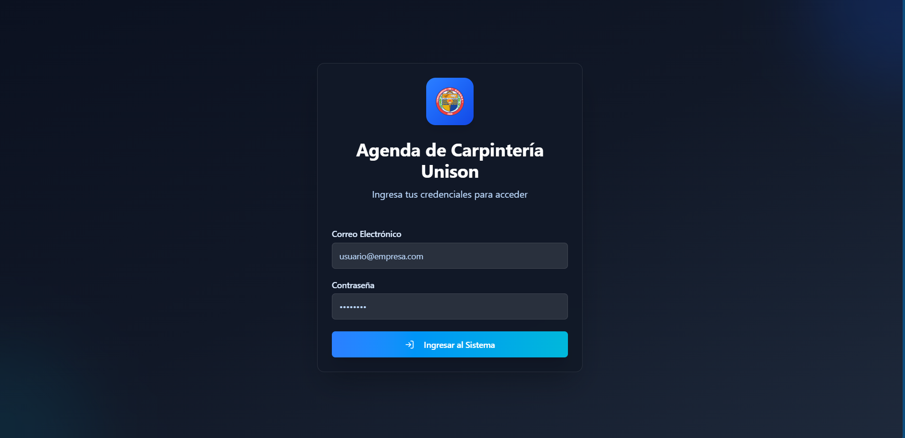

# Vistas

### LoginPage — Ruta: `/`

<figure><figcaption>
LoginPage
</figcaption></figure>

**Objetivo**

* Permitir al usuario identificarse en la aplicación.

**Elementos principales**

* Campos: correo electrónico y contraseña.
* Botón principal: "Ingresar al Sistema".
* Mensajes de error visibles en pantalla.
* Logotipo y texto introductorio.

**Flujo general**

1. El usuario introduce credenciales y pulsa "Ingresar".
2. La pantalla muestra estado de carga y, según el resultado, avisa o continúa.
3. Tras un ingreso correcto la navegación avanza a la vista principal del sistema.

***

### DashboardPage — Ruta: `/dashboard`

<figure><figcaption>
Dashboard
</figcaption></figure>

**Objetivo**

* Ofrecer un panorama rápido del estado del taller con métricas y accesos directos.

**Elementos principales**

* Tarjetas resumen (pendientes, en progreso, completados).
* Lista de servicios recientes.
* Gráficas de distribución por estado y tipo.
* Botón para crear un nuevo servicio.

Flujo general

1. La página presenta tarjetas de resumen, servicios recientes y graficas.
2. El usuario puede usar accesos rápidos para ir a listados, crear un elemento o ver un detalle.
3. Desde aquí se inicia la navegación hacia secciones específicas del sistema.

***

### ServicesListPage — Ruta: `/services`

<figure><figcaption>
ServiceListPage
</figcaption></figure>

**Objetivo**

* Mostrar el catálogo de solicitudes y permitir filtrado y búsqueda.

**Elementos principales**

* Campo de búsqueda.
* Filtros (estado, tipo, prioridad).
* Botón "Nueva Solicitud".
* Lista de servicios como tarjetas o filas con información resumida.

**Flujo general**

1. El usuario filtra o busca para reducir la lista.
2. Selecciona un servicio para ver su detalle o pulsa para crear uno nuevo.
3. La navegación va de la lista al detalle y de vuelta.

***

### ServiceCreatePage — Ruta: `/services/new`

<figure><figcaption>
ServiceCreatePage pt.1
</figcaption></figure>

<figure><figcaption>
ServiceCreatePage pt.2
</figcaption></figure>

**Objetivo**

* Reunir los datos necesarios para registrar una nueva solicitud de servicio.

**Elementos principales**

* Formulario dividido en secciones: información del servicio, datos del solicitante, asignación de tecnico, asignacion de equipos.
* Controles de fechas, selects y campos de texto.
* Botones: "Crear Servicio" y "Cancelar".
* Validación de campos y mensajes de error.

**Flujo general**

1. El usuario completa el formulario y valida los campos.
2. Al enviar, la pantalla procesa la creación y avisa del resultado.
3. Finalizada la creación, la navegación muestra el nuevo recurso o la lista.

***

### ServiceDetailPage — Ruta: `/services/:id`

<figure><figcaption>
ServiceDetailPage pt.1
</figcaption></figure>

<figure><figcaption>
ServiceDetailPage pt.2
</figcaption></figure>

<figure><figcaption>
ServiceDetailPage pt.3
</figcaption></figure>

**Objetivo**

* Ver y gestionar la información completa de una solicitud concreta.

**Elementos principales**

* Información principal del servicio (título, estado, prioridad, fechas).
* Datos del solicitante.
* Panel para gestionar estado, prioridad y asignaciones.
* Listado de equipos asignados y sección de evidencias (imágenes).
* Acciones: editar, guardar, eliminar.

**Flujo general**

1. El usuario revisa los datos y puede editar campos o añadir evidencias/equipos.
2. Las acciones realizan cambios en la información mostrada y mantienen al usuario en la misma vista o lo llevan de vuelta a la lista según la acción (por ejemplo, al eliminar).

***

### EquipmentPage — Ruta: `/equipment`

<figure><figcaption>
EquipmentPage
</figcaption></figure>

<figure><figcaption>
Agregar nuevo equipo o utensilio - EquipmentPage
</figcaption></figure>

**Objetivo**

* Administrar el inventario de equipos, utensilios y maquinaria.

**Elementos principales**

* Estadísticas resumen.
* Tabs o filtros por tipo (maquinaria, equipo, utensilios).
* Listado de items con estado y acciones (editar, eliminar).
* Diálogos para crear/editar items y programar mantenimientos.

**Flujo general**

1. El usuario explora o filtra el inventario.
2. Puede abrir formularios para agregar o editar un item.
3. También puede programar o marcar mantenimientos.

***

### ReportsPage — Ruta: `/reports`

<figure><figcaption></figcaption></figure>

**Objetivo**

* Generar y exportar reportes con distintos criterios (diario, semanal, por rango o por servicio).

**Elementos principales**

* Selector de tipo de reporte.
* Filtros por técnico y rango de fechas.
* Controles de exportación (imprimir / exportar Excel).
* Área con la vista del reporte lista para impresión.

**Flujo general**

1. El usuario selecciona el tipo de reporte y aplica filtros.
2. Visualiza los resultados en pantalla y puede exportarlos o imprimirlos.

***

### ProfilePage — Ruta: `/profile`

<figure><figcaption>
ProfilePage
</figcaption></figure>

**Objetivo**

* Mostrar información del usuario conectado y permitir cerrar sesión.

**Elementos principales**

* Datos personales
* Sección de permisos según rol.
* Información del sistema (versión/estado).
* Botón "Cerrar Sesión".

**Flujo general**

1. El usuario consulta sus datos y, si lo desea, cierra sesión para volver a la pantalla de login.

***

### UsersPage — Ruta: `/users`

<figure><figcaption>
UsersPage
</figcaption></figure>

<figure><figcaption>
Nuevo Jefe de Taller - UsersPage
</figcaption></figure>

**Objetivo**

* Administrar usuarios con rol de jefes de taller (acceso restringido).

**Elementos principales**

* Lista de usuarios.
* Diálogo para crear nuevo usuario.
* Confirmación para eliminar usuarios.

**Flujo general**

1. Usuario con permiso ve la lista y puede crear o eliminar entradas.
2. Las acciones abren formularios o diálogos y muestran el resultado en la misma vista.

***

### TechniciansPage — Ruta: `/technicians`

<figure><figcaption>
TechniciansPage
</figcaption></figure>

**Objetivo**

* Listar técnicos y mostrar su carga de trabajo.

**Elementos principales**

* Campo de búsqueda.
* Listado de técnicos con badges de estado y conteo de servicios activos.
* Botón para crear un nuevo técnico.

**Flujo general**

1. El usuario filtra la lista y selecciona un técnico para ver su ficha.
2. La navegación va de la lista al detalle del técnico.

***

### TechnicianCreatePage — Ruta: `/technicians/new`

<figure><figcaption>
TechnicianCreatePage
</figcaption></figure>

***

### TechnicianDetailPage — Ruta: `/technicians/:id`

**Objetivo**

* Presentar la ficha de un técnico y permitir edición de datos básicos.

**Elementos principales**

* Datos personales del técnico (nombre, teléfono, especialidad, cargo).
* Botón "Editar" que habilita edición de campos.
* Listado de servicios asignados (resumen).

**Flujo general**

* Mostrar información y acciones de edición.
* Guardar cambios mantiene al usuario en la misma vista y actualiza los datos mostrados.
