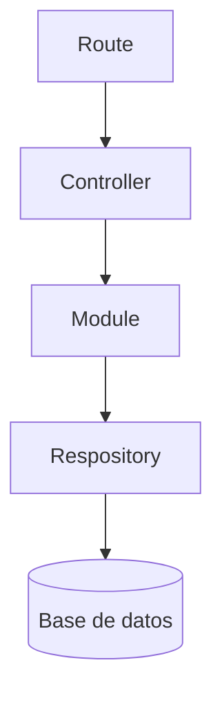

# Arquitectura

El proyecto se basa en la arquitectura ACMD y su patron de diseño es en Capas y pipe and filter

## Flujo



## Capas

* Routes: se encarga de definir los endpoints HTTP y dirigir cada petición al controlador correspondiente.
* Controllers: reciben request/response y se obtiene todos los parametros y bodies, tambien se encarga de los manejos de errores
* Modules: lógica de negocio
* repository: consultas a la base de datos por medio de querys

## Estructura

```
CarpinteriaSF/
 ├── controllers/
 |    ├── LoginController.js
 |    ├── personalController.js
 |    ├── reportesController.js
 |    ├── seguimientoController.js
 |    ├── servicioController.js
 |    ├── solicitanteController.js
 |    ├── utensilioController.js
 ├── database
 |    ├── conexionBD.js
 |    ├── taller_carpinteriaBD.sql
 ├── modules
 |    ├── LoginModule.js
 |    ├── authMiddleware.js
 |    ├── mantenimientoCron.js
 |    ├── personalModule.js
 |    ├── reportesModule.js
 |    ├── seguimientoModule.js
 |    ├── servicioModule.js
 |    ├── solicitanteModule.js
 |    ├── utensilioModule.js
 ├── repository/
 |    ├── LoginQuerys.js
 |    ├── personalQuerys.js
 |    ├── seguimientoQuerys.js
 |    ├── servicioQuerys.js
 |    ├── solicitanteQuerys.js
 |    ├── utensilioQuerys.js
 ├── routes
 |    ├── LoginRoute.js
 |    ├── personalRoute.js
 |    ├── reportesRoute.js
 |    ├── seguimientoRoute.js
 |    ├── servicioRoute.js
 |    ├── solicitanteRoute.js
 |    ├── utensilioRoute.js
 ├── app.js
 ├── package-lock.json
 └── package.jsnon
```
