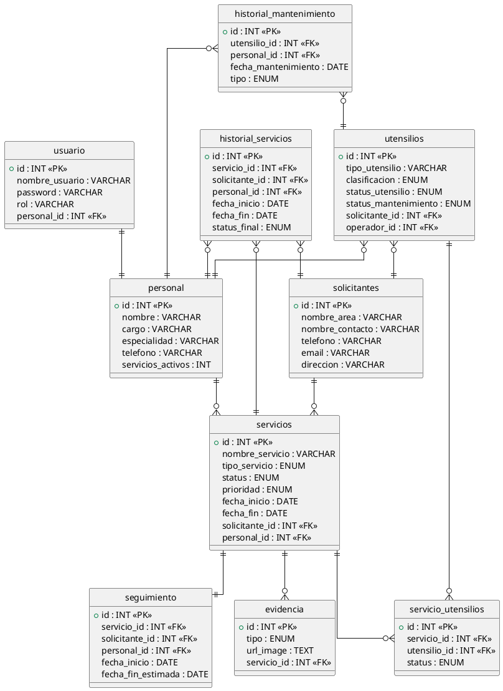

# Base de datos

## Diagrama de la base de datos PlantUML



## Estructura de la base de datos MYSQL

La estructura esta en formato SQL para un mejor entendimiento del funcionamiento.

```sql
CREATE TABLE personal (
    id                INT UNSIGNED    NOT NULL AUTO_INCREMENT,
    nombre            VARCHAR(120)    NOT NULL,
    cargo             VARCHAR(80)     NOT NULL,
    especialidad      VARCHAR(150)    NOT NULL,
    telefono          VARCHAR(20)     NOT NULL,
    servicios_activos INT UNSIGNED    NOT NULL DEFAULT 0,
    created_at        TIMESTAMP       NOT NULL DEFAULT CURRENT_TIMESTAMP,
    updated_at        TIMESTAMP       NOT NULL DEFAULT CURRENT_TIMESTAMP
                                               ON UPDATE CURRENT_TIMESTAMP,
    PRIMARY KEY (id)
) ENGINE=InnoDB;

-- ============================================================
-- TABLA: CLIENTES
-- ============================================================
CREATE TABLE solicitantes (
    id                           INT UNSIGNED  NOT NULL AUTO_INCREMENT,
    nombre_area                  VARCHAR(150)  NOT NULL,
    nombre_contacto              VARCHAR(120)  NOT NULL,
    telefono                     VARCHAR(20)   NOT NULL,
    email                        VARCHAR(120)  NOT NULL,
    direccion                    VARCHAR(250)  NOT NULL,
    servicios_activos            INT UNSIGNED  NOT NULL DEFAULT 0,
    total_servicios_completados  INT UNSIGNED  NOT NULL DEFAULT 0,
    created_at                   TIMESTAMP     NOT NULL DEFAULT CURRENT_TIMESTAMP,
    updated_at                   TIMESTAMP     NOT NULL DEFAULT CURRENT_TIMESTAMP
                                                        ON UPDATE CURRENT_TIMESTAMP,
    PRIMARY KEY (id)
) ENGINE=InnoDB;

-- ============================================================
-- TABLA: UTENSILIOS
-- ============================================================
CREATE TABLE utensilios (
    id                   INT UNSIGNED  NOT NULL AUTO_INCREMENT,
    clasificacion        ENUM('Herramienta','Maquinaria','Equipo') NOT NULL,
    tipo_utensilio       VARCHAR(100)  NOT NULL,
    solicitante_id           INT UNSIGNED  NULL COMMENT 'Ubicación: cliente o área donde está el utensilio',
    operador_id          INT UNSIGNED  NULL COMMENT 'Personal que lo opera actualmente',
    Rangos_mantenimiento VARCHAR(100)  NULL COMMENT 'dias especificados para mantenimiento',
    status_mantenimiento ENUM('Al día','Próximo','En proceso') NOT NULL DEFAULT 'Al día',
    status_utensilio     ENUM('En uso','Disponible','Mantenimiento') NOT NULL DEFAULT 'Disponible',
    ultimo_mantenimiento DATE          NULL COMMENT 'Fecha del último mantenimiento realizado',
    created_at           TIMESTAMP     NOT NULL DEFAULT CURRENT_TIMESTAMP,
    updated_at           TIMESTAMP     NOT NULL DEFAULT CURRENT_TIMESTAMP
                                                ON UPDATE CURRENT_TIMESTAMP,
    PRIMARY KEY (id),
    CONSTRAINT fk_utensilio_solicitante  FOREIGN KEY (solicitante_id)  REFERENCES solicitantes (id) ON DELETE SET NULL,
    CONSTRAINT fk_utensilio_operador FOREIGN KEY (operador_id) REFERENCES personal (id) ON DELETE SET NULL,
    INDEX idx_utensilio_solicitante (solicitante_id),
    INDEX idx_utensilio_operador (operador_id)
) ENGINE=InnoDB;

-- ============================================================
-- TABLA: SERVICIOS
-- ============================================================
CREATE TABLE servicios (
    id             INT UNSIGNED   NOT NULL AUTO_INCREMENT,
    nombre_servicio VARCHAR (250) NOT NULL,
    solicitante_id     INT UNSIGNED   NOT NULL,
    personal_id    INT UNSIGNED   NULL COMMENT 'Responsable principal del servicio',
    tipo_servicio  ENUM('Mantenimiento preventivo','Instalación','Reparación','Otros') NOT NULL,
    fecha_inicio   DATE           NOT NULL,
    fecha_fin      DATE           NULL COMMENT 'Se llena al completar el servicio',
    status         ENUM('Pendiente','En progreso','Completado') NOT NULL DEFAULT 'Pendiente',
    prioridad      ENUM('baja','media','alta') not NULL DEFAULT 'media',
    ubicacion         VARCHAR(250)  NOT NULL,
    created_at     TIMESTAMP      NOT NULL DEFAULT CURRENT_TIMESTAMP,
    updated_at     TIMESTAMP      NOT NULL DEFAULT CURRENT_TIMESTAMP
                                           ON UPDATE CURRENT_TIMESTAMP,
    PRIMARY KEY (id),
    CONSTRAINT fk_servicio_solicitante  FOREIGN KEY (solicitante_id)  REFERENCES solicitantes (id),
    CONSTRAINT fk_servicio_personal FOREIGN KEY (personal_id) REFERENCES personal (id) ON DELETE SET NULL,
    INDEX idx_servicio_solicitante (solicitante_id),
    INDEX idx_servicio_personal (personal_id)
) ENGINE=InnoDB;

-- ============================================================
-- TABLA: Usuario ---Login
-- El mismo usuario logeado podra asignarse un servicio por eso se liga a personal 
-- ============================================================
CREATE TABLE Usuario (
    id                     INT UNSIGNED   NOT NULL AUTO_INCREMENT,
    nombre_usuario         VARCHAR (150)  NOT NULL,
    password               VARCHAR (255)  NOT NULL ,
    rol                    VARCHAR (100)  NOT NULL,
    personal_id            INT UNSIGNED   NULL,
    created_at     TIMESTAMP      NOT NULL DEFAULT CURRENT_TIMESTAMP,
    updated_at     TIMESTAMP      NOT NULL DEFAULT CURRENT_TIMESTAMP
                                           ON UPDATE CURRENT_TIMESTAMP,
    PRIMARY KEY (id),
    CONSTRAINT fk_usuario_personal FOREIGN KEY (personal_id) REFERENCES personal (id) ON DELETE SET NULL,
    INDEX idx_usuario_personal (personal_id)
) ENGINE=InnoDB;

-- ============================================================
-- TABLA: EVIDENCIA
-- ============================================================
CREATE TABLE evidencia (
    id             INT UNSIGNED   NOT NULL AUTO_INCREMENT,
    servicio_id    INT UNSIGNED   NOT NULL,
    tipo           ENUM ('inicio','fin') NOT NULL DEFAULT 'inicio',
    url_image      LONGTEXT NOT NULL,
    created_at     TIMESTAMP      NOT NULL DEFAULT CURRENT_TIMESTAMP,
    updated_at     TIMESTAMP      NOT NULL DEFAULT CURRENT_TIMESTAMP
                                           ON UPDATE CURRENT_TIMESTAMP,
    PRIMARY KEY (id),
    CONSTRAINT fk_evidencia_servicio  FOREIGN KEY (servicio_id)  REFERENCES servicios  (id) ON DELETE CASCADE,
    INDEX idx_evidencia_servicio (servicio_id)
) ENGINE=InnoDB;

-- ============================================================
-- TABLA PIVOTE: SERVICIO_UTENSILIOS
-- Permite asignar múltiples utensilios a un mismo servicio
-- ============================================================
CREATE TABLE servicio_utensilios (
    id           INT UNSIGNED NOT NULL AUTO_INCREMENT,
    servicio_id  INT UNSIGNED NOT NULL,
    utensilio_id INT UNSIGNED NOT NULL,
    Status ENUM ('Finalizado','En uso') NOT NULL DEFAULT 'En uso',
    PRIMARY KEY (id),
    UNIQUE KEY uq_servicio_utensilio (servicio_id, utensilio_id),
    CONSTRAINT fk_su_servicio  FOREIGN KEY (servicio_id)  REFERENCES servicios  (id) ON DELETE CASCADE,
    CONSTRAINT fk_su_utensilio FOREIGN KEY (utensilio_id) REFERENCES utensilios (id) ON DELETE CASCADE,
    INDEX idx_su_servicio (servicio_id),
    INDEX idx_su_utensilio (utensilio_id)
) ENGINE=InnoDB;

-- ============================================================
-- TABLA: SEGUIMIENTO
-- Detalle operativo de cada servicio (1:1 con servicios)
-- ============================================================
CREATE TABLE seguimiento (
    id                INT UNSIGNED  NOT NULL AUTO_INCREMENT,
    nombre_servicio VARCHAR (250) NOT NULL,
    servicio_id       INT UNSIGNED  NOT NULL UNIQUE COMMENT 'Un seguimiento por servicio',
    solicitante_id        INT UNSIGNED  NOT NULL,
    personal_id       INT UNSIGNED  NULL,
    ubicacion         VARCHAR(250)  NOT NULL,
    tipo_seg_servicio     ENUM('Mantenimiento preventivo','Instalación','Reparación','Otros') NOT NULL,
    fecha_inicio      DATE          NOT NULL,
    fecha_fin_estimada DATE         NULL,
    observaciones     TEXT          NULL COMMENT 'Notas técnicas, avances, incidencias',
    created_at        TIMESTAMP     NOT NULL DEFAULT CURRENT_TIMESTAMP,
    updated_at        TIMESTAMP     NOT NULL DEFAULT CURRENT_TIMESTAMP
                                             ON UPDATE CURRENT_TIMESTAMP,
    PRIMARY KEY (id),
    CONSTRAINT fk_seg_servicio FOREIGN KEY (servicio_id) REFERENCES servicios (id) ON DELETE CASCADE,
    CONSTRAINT fk_seg_solicitante  FOREIGN KEY (solicitante_id)  REFERENCES solicitantes  (id),
    CONSTRAINT fk_seg_personal FOREIGN KEY (personal_id) REFERENCES personal  (id) ON DELETE SET NULL,
    INDEX idx_seg_servicio (servicio_id),
    INDEX idx_seg_solicitante (solicitante_id),
    INDEX idx_seg_personal (personal_id)
) ENGINE=InnoDB;

-- ============================================================
-- TABLA: HISTORIAL_SERVICIOS
-- Registro inmutable de servicios completados — base para reportes
-- ============================================================
CREATE TABLE historial_servicios (
    id            INT UNSIGNED  NOT NULL AUTO_INCREMENT,
    nombre_servicio VARCHAR (250) NOT NULL,
    servicio_id   INT UNSIGNED  NOT NULL,
    solicitante_id    INT UNSIGNED  NOT NULL,
    personal_id   INT UNSIGNED  NULL,
    tipo_hs_servicio ENUM('Mantenimiento preventivo','Instalación','Reparación','Otros') NOT NULL,
    fecha_inicio  DATE          NOT NULL,
    fecha_fin     DATE          NOT NULL,
    status_final  ENUM('Completado','Cancelado') NOT NULL DEFAULT 'Completado',
    duracion_dias INT UNSIGNED  AS (DATEDIFF(fecha_fin, fecha_inicio)) STORED
                                   COMMENT 'Calculado automáticamente',
    notas         TEXT          NULL,
    registrado_at TIMESTAMP     NOT NULL DEFAULT CURRENT_TIMESTAMP,
    PRIMARY KEY (id),
    CONSTRAINT fk_hs_servicio FOREIGN KEY (servicio_id) REFERENCES servicios (id),
    CONSTRAINT fk_hs_solicitante  FOREIGN KEY (solicitante_id)  REFERENCES solicitantes  (id),
    CONSTRAINT fk_hs_personal FOREIGN KEY (personal_id) REFERENCES personal  (id) ON DELETE SET NULL,
    -- Índices para reportes por rango de fechas
    INDEX idx_hs_fecha_inicio  (fecha_inicio),
    INDEX idx_hs_fecha_fin     (fecha_fin),
    INDEX idx_hs_solicitante   (solicitante_id),
    INDEX idx_hs_personal      (personal_id),
    INDEX idx_hs_tipo          (tipo_hs_servicio)
) ENGINE=InnoDB;

-- ============================================================
-- TABLA: HISTORIAL_MANTENIMIENTO
-- Registro de cada mantenimiento realizado a utensilios
-- ============================================================
CREATE TABLE historial_mantenimiento (
    id                INT UNSIGNED  NOT NULL AUTO_INCREMENT,
    utensilio_id      INT UNSIGNED  NOT NULL,
    personal_id       INT UNSIGNED  NULL COMMENT 'Técnico que realizó el mantenimiento',
    fecha_mantenimiento DATE        NOT NULL,
    tipo              ENUM('Preventivo','Correctivo','Inspección') NOT NULL,
    descripcion       TEXT          NOT NULL,
    proxima_fecha     DATE          NULL COMMENT 'Próximo mantenimiento programado',
    created_at        TIMESTAMP     NOT NULL DEFAULT CURRENT_TIMESTAMP,
    PRIMARY KEY (id),
    CONSTRAINT fk_hm_utensilio FOREIGN KEY (utensilio_id) REFERENCES utensilios (id),
    CONSTRAINT fk_hm_personal  FOREIGN KEY (personal_id)  REFERENCES personal   (id) ON DELETE SET NULL,
    INDEX idx_hm_fecha     (fecha_mantenimiento),
    INDEX idx_hm_utensilio (utensilio_id)
) ENGINE=InnoDB;
```
